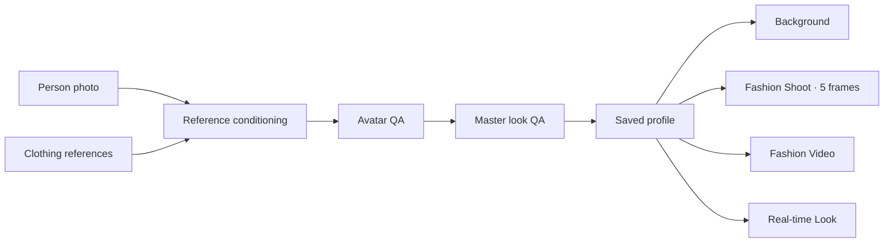

# Wardrobe

An auditable AI wardrobe studio that turns a person photo and clothing references into a reusable master look, then carries that same approved look into backgrounds, fashion shoots, video, and a real-time camera experience.

> **Engineering beta.** The public beta is running the exact audited commit `1a4a69e701798ef771d3ab01c636946ad67a4334`. Its health endpoint is ready, but the complete verification suite is not green and several downstream experiences still need fresh end-to-end proof. See [Current status](docs/PRODUCT_AND_STATUS.md) before evaluating it.

[Open the beta](https://beta.madeforthisjob.com/) · [Evaluator guide](docs/EVALUATOR_GUIDE_UA.md) · [Local setup](docs/LOCAL_SETUP.md) · [Architecture](docs/ARCHITECTURE.md)

## What it does

Wardrobe keeps generation behind explicit evidence and QA contracts:

1. Upload a person photo and clothing references.
2. Normalize and classify the inputs without inventing invisible details.
3. Generate and approve a reusable avatar and master look.
4. Continue from that saved look without uploading the person again.
5. Create one of four independent outputs:
   - a standard **Background** image;
   - a five-frame **Fashion Shoot** based on a locked visual style;
   - a reference-conditioned **Fashion Video**;
   - a consent-gated **Real-time Look** camera session.



The four branches share the approved look, but they are separate products. A background is not a fashion shoot; Creative Universe is the internal system that builds a Fashion Shoot style pack, not an extra user-facing output.

## Authentic project output

The repository includes the checked-in comparison sheet used for the original avatar and outfit evidence:

*Authentic source → avatar → outfit evidence remains in the private engineering repository and is intentionally not copied into this public documentation draft.*

It also contains the real Fashion Shoot style atlas generated from the current style catalog:

*The real Fashion Shoot style atlas remains in the private engineering repository and is intentionally not copied into this public documentation draft.*

These are project artifacts, not illustrative stock screenshots.

## Product blocks

| Block | User outcome | Current beta truth |
|---|---|---|
| Profile and saved looks | Return to an avatar, add clothes, preserve a draft across refresh | Implemented; browser ownership and 30-day profile storage are present |
| Core look | Person + garments → approved master look | State machine, conditioning, runner and QA are implemented; focused conditioning and runner tests pass |
| Backgrounds | One approved look in one selected standard scene | 16 published presets are live; a fresh generation proof was not rerun during this documentation audit |
| Fashion Shoot | One locked style → five distinct fashion frames | 15 Create Universe styles and two ready legacy modes are available; two legacy cards are preview-only; full five-frame E2E proof is still incomplete |
| Fashion Video | Approved look + verified style video + verified motion reference → clip | Service, routes, three reference styles and 151 focused tests are present; no fresh paid-provider smoke was run for this audit |
| Real-time Look | Approved look in a short consent-gated camera session | Contract, UI and token route exist; full granted-camera E2E is not yet proven |
| God View | Read-only view across tester sessions | Implemented as a separately gated engineering surface |
| Live monitor | Real job events, checkpoints, stalls and recovery | Implemented for engineering diagnostics |

The detailed evidence, known failures, and catalog counts are in [Product and release status](docs/PRODUCT_AND_STATUS.md).

## Why the pipeline is reliable

The central unit is not a free-running agent. It is an immutable job executed by a bounded state machine:

```text
immutable inputs + hashes
→ deterministic conditioning
→ generation-ready evidence packs
→ fixed provider route
→ candidate generation
→ technical and semantic QA
→ receipts, events, checkpoints and content-addressed outputs
```

Important properties:

- inputs, derivatives, prompts, model routes and outputs are hash-bound;
- missing evidence becomes `NEEDS_INPUT`, not a guessed detail;
- retries are bounded and resume the same persisted job where possible;
- failed downstream stages do not regenerate an approved avatar or master look;
- public API projections remove local paths, provider internals and secrets;
- original files remain private and are not cached as public previews;
- mock and replay modes verify orchestration but never count as real generation proof.

See [Architecture](docs/ARCHITECTURE.md) for components and data flow.

## Quick start

Requirements:

- Git;
- Node.js 22+ and npm;
- `ffmpeg` and `ffprobe` for video inspection;
- one real image transport: Higgsfield CLI or OpenRouter API;
- one semantic QA transport: Codex CLI or OpenRouter API;
- optional FAL API access for Real-time Look;
- optional Magnific MCP access for interactive agent workflows. Magnific is not currently wired into the long-running beta server.

```bash
git clone <private-repository-url>
cd <repository-directory>
npm ci
npm run app
```

Open `http://127.0.0.1:4173`.

The app can boot without committing credentials. Real provider calls require environment configuration or an authenticated CLI/MCP session on the host. Do not place API keys, session secrets, browser profiles, OAuth caches, or provider auth files in Git.

For complete installation commands, macOS/Linux dependencies, Codex, Higgsfield, OpenRouter, Magnific MCP, FAL/Lucy, video routes, health checks and troubleshooting, use [Local setup and provider connections](docs/LOCAL_SETUP.md).

## Verification

Focused, non-paid checks verified on this audited commit:

```bash
npm run test:conditioning   # 31/31
npm run test:runner         # 39/39
node --test --test-concurrency=2 test/web/god-view*.test.js  # 4/4
node --test --test-concurrency=2 test/video/*.test.js        # 151/151
```

The official complete gate remains:

```bash
npm test
npm run verify:contracts
npm run verify:canon
npm run verify:output
```

Current limitation: resource preflight refused the full command on the audit host because swap usage exceeded its safety threshold. Running the underlying suite produced `906/988` passing tests and `82` failures. Those failures include real schema, framing, Fashion Shoot fixture, run-service, and Real-time Look teardown drift; they must not be hidden behind the healthy public endpoint.

## Repository map

```text
src/conditioning/      deterministic input preparation and readiness
src/runner/            immutable jobs, events, checkpoints and receipts
src/providers/         image, VLM and video provider adapters
src/qa/                technical output verification
src/web/               beta app, profiles, scenes, shoots, video and live routes
src/monitor/           operational event monitor and supervisor
assets/                versioned scene and reference packs
config/                runtime policies and product catalogs
schemas/               strict machine-readable contracts
prompts/               versioned prompt templates
test/                  unit, contract, integration and browser-facing tests
docs/qa/               generated QA atlases and evidence reports
runtime/               local mutable state; never a source artifact
```

## Documentation

- [Product and release status](docs/PRODUCT_AND_STATUS.md)
- [Architecture](docs/ARCHITECTURE.md)
- [Local setup and configuration](docs/LOCAL_SETUP.md)
- [Evaluator guide (UA)](docs/EVALUATOR_GUIDE_UA.md)
- [Security and operations](docs/SECURITY_AND_OPERATIONS.md)

## Project status

This repository is private and under active beta development. It does not currently declare an open-source license. Absence of a license means no reuse permission is granted outside the repository owner's explicit authorization.
