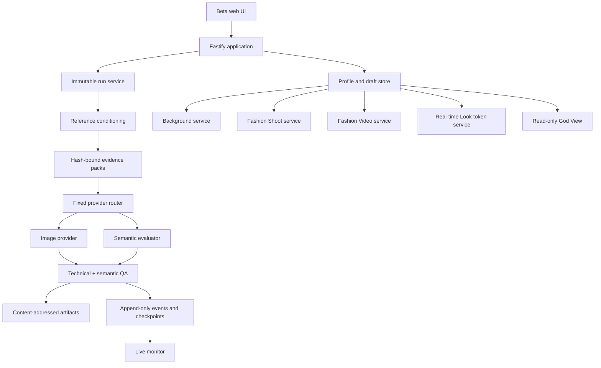

# Architecture

## System shape

Wardrobe separates declarative work from permission to execute it. Jobs describe immutable inputs, policies and desired outputs. Provider adapters receive credentials only from the running environment.



## Core boundaries

### Conditioning

`src/conditioning` validates metadata, orientation, color space, resolution, framing and detail risk. It creates deterministic derivatives and records parent/output hashes. It never converts absent evidence into a generated fact.

### Runner

`src/runner` owns the central state machine, content-addressed receipts, idempotency keys, attempts, checkpoints and exports. A completed checkpoint can be replayed only when every immutable binding still matches.

### Provider adapters

`src/providers` holds the external transport boundary. The current image router supports Higgsfield, OpenRouter image generation, and an explicitly test-only Codex image route. VLM evaluation supports Codex or OpenRouter. Video uses a provider router with bounded Higgsfield attempts and a capability-aware OpenRouter fallback.

No model name or provider credential is accepted from the browser as authority.

### QA

Technical QA validates files, dimensions, color and delivery. Semantic QA evaluates identity, garment evidence, anatomy, framing, scene/style adherence and defects. A bare model `PASS` is insufficient: receipts must carry the runner-required checks and exact evidence bindings.

### Profiles and runtime

The anonymous beta profile belongs to a browser session and persists saved avatars/looks. Mutable data lives under `ZEELY_RUNTIME_ROOT`; using a different root can make intact data appear missing. Runtime is not source control and must be backed up separately.

### Product services

- `SceneService`: one standard background image.
- `EditorialShootService`: compatibility name for the five-frame Fashion Shoot service.
- `VideoService`: reference-conditioned video creation and QA.
- Real-time token issuer: short-lived, consent-gated FAL/Lucy access.
- God View: read-only cross-session engineering projection.
- Monitor: redacted real-time events and stall diagnostics.

## Persistence model

```text
runtime/
├── runs/                 core look jobs and artifacts
├── profiles/             browser-owned saved avatars and looks
├── drafts/               resumable upload state
├── scenes/               background jobs and receipts
├── editorial-shoots/     Fashion Shoot state (legacy internal name)
├── video/                 Fashion Video jobs and clips
└── monitoring/            operational projections
```

Exact directory names can evolve; services must resolve them from the same runtime root rather than reconstructing paths independently.

## Trust model

1. Source bytes are hashed at ingestion.
2. Every derivative declares its parent and operation.
3. Prompts bind logical attachment roles, not local filesystem paths.
4. Provider output is downloaded only through constrained adapters.
5. QA binds candidate bytes, evidence, authority and receipt.
6. Public projections remove private paths and provider metadata.
7. Original/private assets use `private, no-store`; only explicit previews may be cacheable.

## Product naming boundary

User-facing language:

- Background
- Fashion Shoot
- Fashion Video
- Real-time Look

Internal compatibility terms such as `editorial`, `shoot bible`, or `Creative Universe` must not leak into customer instructions. Creative Universe may appear in engineering documentation as the style-construction subsystem.

